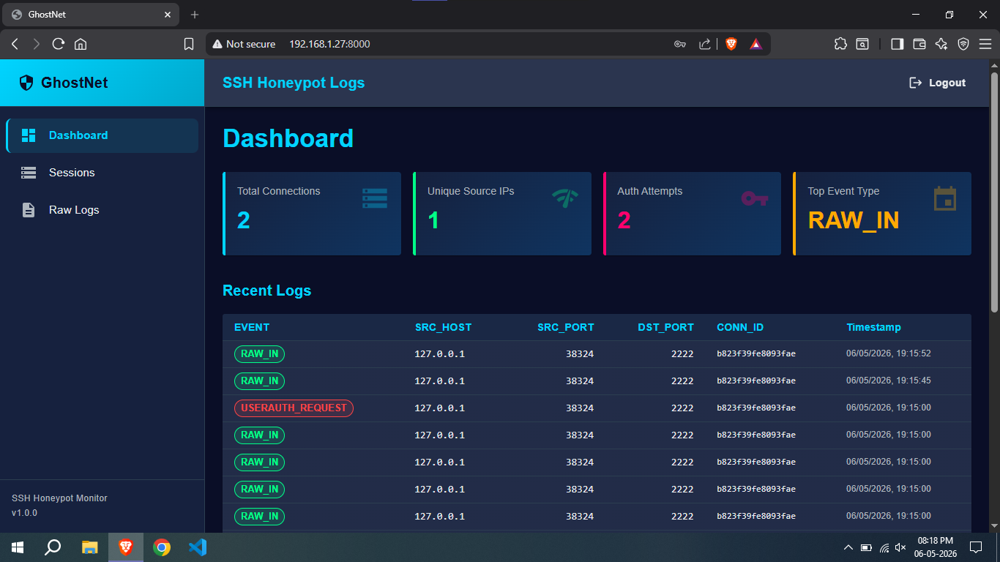
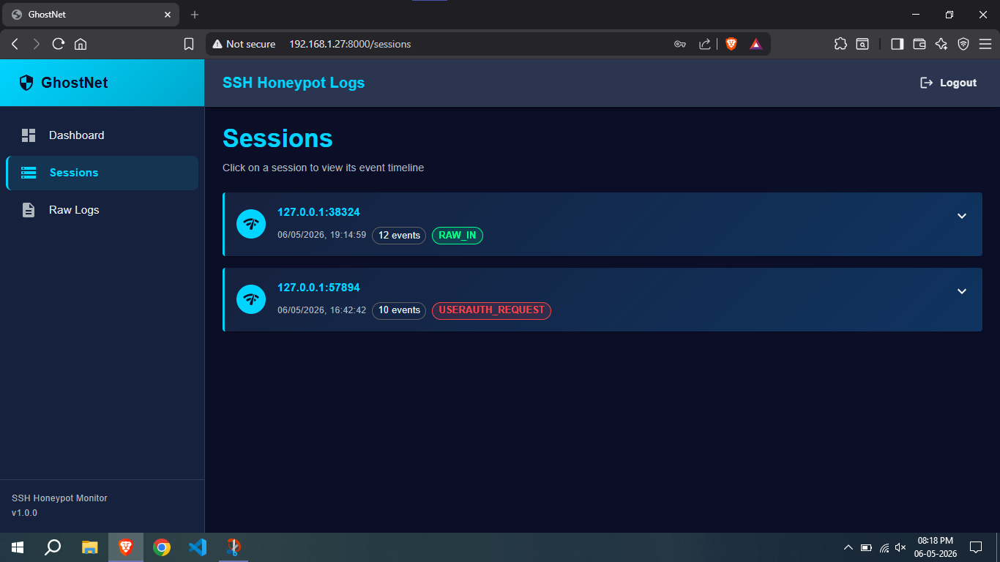
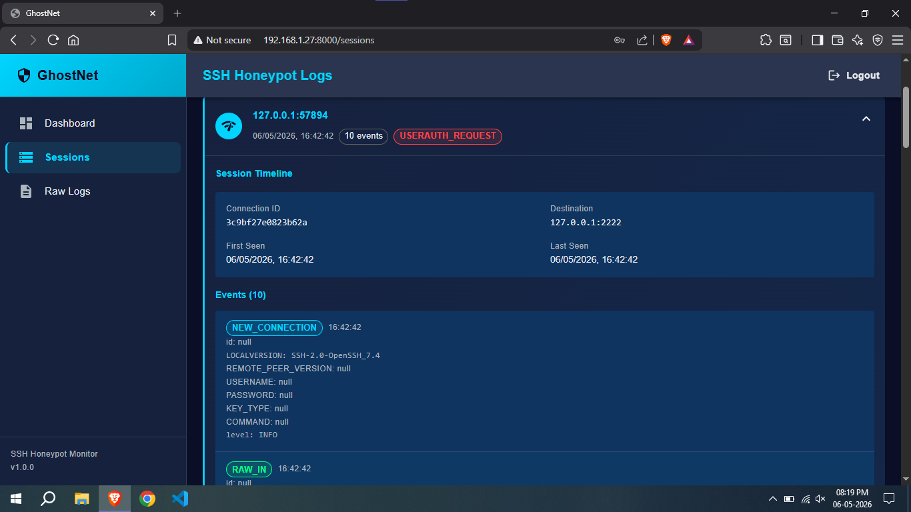
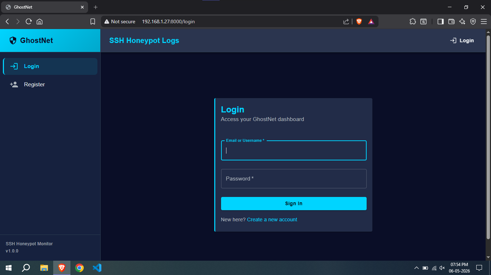
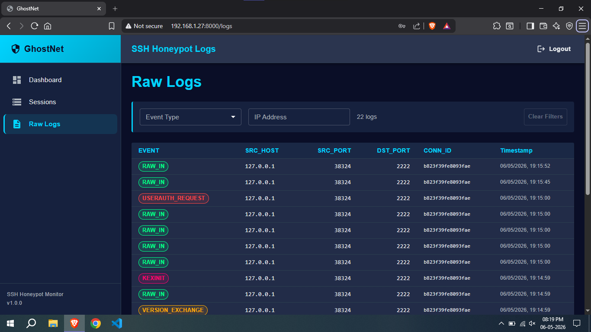

# 👻 GhostNet-Honeypot
### Honeypot-Based Attack Monitoring System

> “Every connection is a suspect. Every packet tells a story.”

GhostNet is a lightweight honeypot framework designed to lure, monitor, and log malicious activity in real-time. Built for security researchers, ethical hackers, and defenders who prefer to see the attack before it happens.

---

## ⚙️ Features
- 🕷️ Real-time attack monitoring
- 📡 Web-based control panel
- 🧠 Intelligent logging of intrusion attempts
- 🐳 Dockerized deployment support
- 🔍 CLI-based control interface
- 📊 Attack visibility & analytics-ready logs

---

## 🧠 Prerequisites Check

GhostNet needs Python, MongoDB, and SSH service active.

---
## 📸 Demo Screenshots

<p align="center">
  
  
</p>
<p align="center">
  
</p>
<p align="center">
  
  
</p>

## 🐍 Python

```bash
python --version
# or
python3 --version
````

Install dependencies:

```bash
pip install -r ghostnet/requirnemts.txt
```

---

## 🍃 MongoDB

Check connection:

```bash
mongosh "mongodb://localhost:27017"
```

If not running:

```bash
docker compose -f docker/mongo-docker-compose.yaml up -d
```

---

## 🔐 SSH

Check SSH status:

```bash
systemctl status ssh
```

Start if needed:

```bash
sudo systemctl start ssh
```

> Used for monitoring or honeypot simulation of SSH attacks.


---

> GhostNet runs only when Python, MongoDB, and SSH are alive.


## 🚀 Installation

### 1. Clone the repo
```bash
git clone https://github.com/cgdhanush/GhostNet-Honeypot.git
cd ghostnet-honeypot
````

### 2. Install dependencies

```bash
pip install -r ghostnet/requirnemts.txt
```

> ⚠️ Yes, the filename is intentional. Don’t “fix” it unless you want chaos.

---


## 📌 CLI Usage

```bash
usage: ghostnet [-h] [-v] [--no-color] [-V] {webserver,sshserver,start} ...

Honeypot-Based Attack Monitoring System

positional arguments:
  {webserver,sshserver,start}
    webserver           Webserver module
    sshserver           SSH server module
    start               Main module

options:
  -h, --help            show this help message and exit
  -v, --verbose         Verbose mode (-vv, -vvv for more details)
  --no-color            Disable colored output (useful for logs/files)
  -V, --version         show program version and exit
```

---

## 🧪 Running GhostNet

### ▶ Start Web Server

```bash
python -m ghostnet webserver
```

### ▶ Start SSH Server

```bash
python -m ghostnet sshserver
```

### ▶ Run Main Module

```bash
python -m ghostnet start
```

---

## ❓ Need Help?

```bash
python -m ghostnet --help
```

---

## 🧠 Philosophy

GhostNet doesn’t block attackers.

It studies them.

Every scan, every probe, every failed login attempt is recorded like forensic evidence in a digital crime scene.

---

## 🛑 Disclaimer

This tool is intended for:

* Cybersecurity research
* Educational purposes
* Controlled lab environments

**Do NOT deploy on unauthorized systems.**

---

## 🧾 Example Use Cases

* Blue team threat intelligence
* Penetration testing environments
* SOC training labs
* Attack behavior analysis

---

## 👁️ Final Note

> “You don’t hunt attackers. You let them find you… and watch closely.”